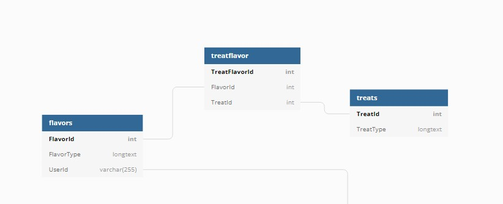

# Pierre's Sweet and Savory Treats

## By Anthony McRae

## Description

MVC web application  where a user is able to log in and log out. Logged users can create, update bakery items. All users have read only access to view bakery items.

## Technologies Used

* C#
* .NET 5.0
* ASP .NET CORE MVC
* Entity Framework
* MySQL
* MySQL Workbench
* Git & GitHub
* Markdown
* NuGet

## Setup Requirements

*download .NET 5.0 SDK  [Click on link for macOS](https://dotnet.microsoft.com/download/dotnet/thank-you/sdk-5.0.401-macos-x64-installer) , [Click on link for Windows 64](https://dotnet.microsoft.com/download/dotnet/thank-you/sdk-5.0.401-windows-x64-installer)

* Open Terminal
* Text Editor (Visual Studio Code)

## Schema



## Installation Requirements

1. Clone this repository in your preferred directory using `https://github.com/toddmac12/Pierre-s-Sweet-and-Savory-Treats`
2. Navigate to the `\BakeryTreat` directory
3. Open with your preferred text editor to view the code base

* To run the program enter the following commands using the Terminal.

4.Navigate to the `\BakeryTreat` directory
5. Create a copy of the database by using the `anthony_mcrae.sql` file included in the repo using MySQL Workbench program.
6. Create an `appsettings.json` file in the `\BakeryTreat` directory add the following code to the file:

```{
 "ConnectionStrings":
  {
    "DefaultConnection": "Server=localhost;Port=3306;database={first_last};uid={YOUR_USERNAME_NAME};pwd={YOUR_PASSWORD};"
  }
}>Copy path</clipboard-copy>
```

* Be sure to replace `{first_last} {YOUR_USERNAME_NAME}` and `{YOUR_PASSWORD}` with the appropriate terms.
* for `{first_last}`, this refers to the database or schema
* make sure to replace this input with what you decide to name the schema/database
* for `{YOUR_USERNAME_NAME}` and `{YOUR_PASSWORD}`, this refers to your username and password for MySQL
* NOTE: Do not include the curly brackets in your code snippet of appsettings.json

7.To create a database, navigate to the root directory . Using the terminal at the command prompt, type `dotnet tool install --global dotnet-ef`. If there is an error stating Unable to resolve project, this means the command wasn't run in the correct directory. The command above will create a migration file with the name Initial. Note that you can name it anything you want, but it's common for the first migration to contain the word `Initial`. Once we have verified that the migration files looks correct and made any necessary changes, run the following command: `dotnet ef database update`. This will automatically update the database to reflect the changes. Finally, to run the application enter `dotnet run` using the terminal and open `http://localhost:5000/` in your preferred browser.
  
## License

MIT License
Copyright (c) [2021] [anthony mcrae]

## Known Bugs

No known bugs at the moment.

## Contact Information

anthonytoddmcrae@gmail.com
